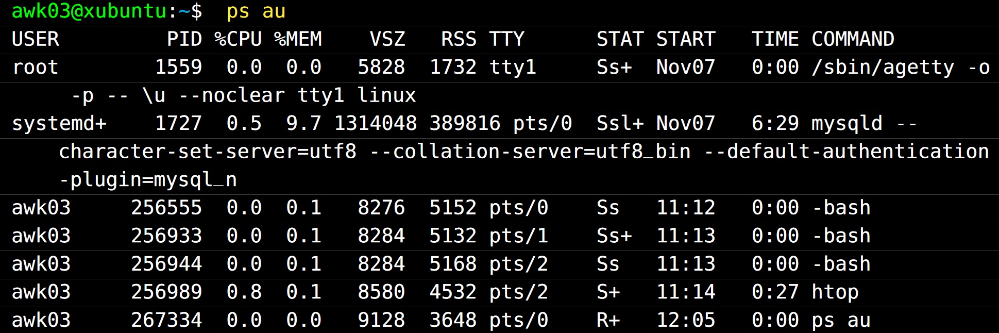

## Fråga 1 | Användaren awk03 kör kommandot `ps au` för att lista processer. Output för detta kommando visas i Figur 1.

### Fyll i det som saknas i kommandot nedan för att döda processen htop?
awk03@xubuntu:∼$ kill ________
`256 989`